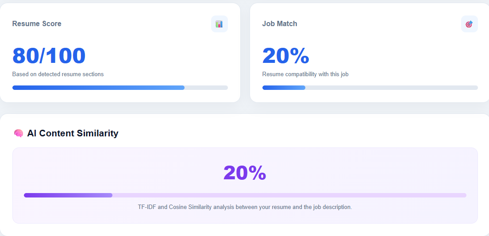

# AI Resume Analyzer

An AI-powered resume analysis and job matching web application built with Django. The system extracts text from PDF resumes using OCR, analyzes resume sections and skills, compares resumes with job descriptions, calculates similarity, and provides AI-powered resume rewriting using a locally running Llama 3.2 model through Ollama.

## Project Preview



## Features

- 📄 PDF Resume Upload
- 🔍 OCR-based Resume Text Extraction
- 📊 Resume Score Calculation
- 🧩 Resume Section Detection
- 🛠️ Technical Skill Detection
- 🎯 Job Description Matching
- 📈 Job Match Percentage
- 🧠 TF-IDF and Cosine Similarity
- ⚠️ Missing Skills Detection
- 💡 Smart Resume Recommendations
- ✍️ AI-Powered Resume Rewriter
- 🤖 Local Llama 3.2 AI through Ollama
- ⏳ Loading states and user-friendly interface
- 📱 Responsive web interface
- ✅ Input validation and error handling

## How It Works

The application follows this workflow:

1. User uploads a PDF resume.
2. The application temporarily processes the uploaded PDF.
3. Poppler converts PDF pages into images.
4. Tesseract OCR extracts text from the resume.
5. Django analyzes the extracted text.
6. Resume sections such as Skills, Education, Experience, Projects, and Certifications are detected.
7. The system calculates a resume score.
8. Skills are detected from the resume.
9. If a Job Description is provided, the system extracts relevant requirements.
10. Resume skills are compared with job requirements.
11. Missing skills and matched skills are displayed.
12. TF-IDF and Cosine Similarity calculate content similarity between the resume and job description.
13. The system generates recommendations for improvement.
14. The AI Resume Rewriter sends selected text to the local Llama 3.2 model through Ollama and generates a professional rewrite.

## Tech Stack

### Backend

- Python
- Django

### AI / Machine Learning

- Scikit-learn
- TF-IDF Vectorization
- Cosine Similarity
- Ollama
- Llama 3.2

### Resume Processing

- Tesseract OCR
- Poppler
- pdf2image
- Pillow

### Frontend

- HTML
- CSS
- JavaScript

### Database

- SQLite

## Setup and Run

1. Clone the repository.
2. Create and activate a Python virtual environment.
3. Install the required dependencies:
   `pip install -r requirements.txt`
4. Make sure Tesseract OCR and Poppler are installed.
5. Install and run Ollama with the Llama 3.2 model.
6. Run the Django development server:
   `python manage.py runserver`
7. Open the application in your browser.

## Project Structure

```text
AI - resume analyzer/
├── analyzer/
│   ├── migrations/
│   ├── __init__.py
│   ├── admin.py
│   ├── apps.py
│   ├── models.py
│   ├── tests.py
│   └── views.py
│
├── resume_analyzer/
│   ├── __init__.py
│   ├── asgi.py
│   ├── settings.py
│   ├── urls.py
│   └── wsgi.py
│
├── templates/
│   └── index.html
│
├── manage.py
├── README.md
└── .gitignore
